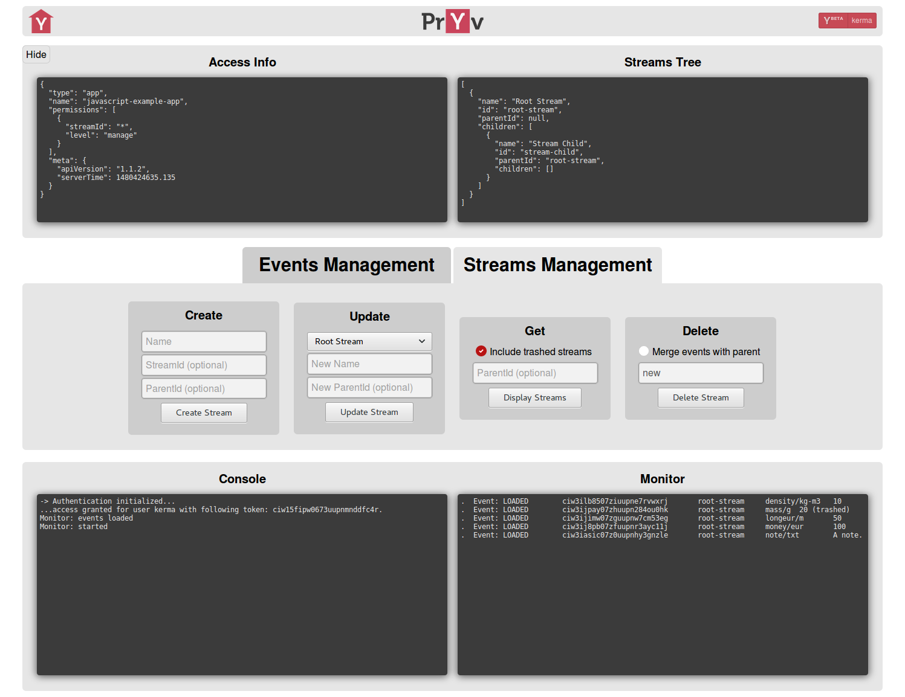

# Pryv Example App

## Description

This application contains examples of the most basic features contained in the [Pryv Javascript Library](https://github.com/pryv/lib-javascript) (authentication, events and streams management).

All the functions using those features are located in `src/js/pryv`.

It is advised to look at the [Javascript Getting Started](http://api.pryv.com/getting-started/javascript/).

## Installation

* Access the app via [Github Pages](https://kerma0.github.io/pryv-example-app/)

  __OR__

* Clone/Download and follow the steps below:
  * Prerequisite: __*npm*__ & __*node*__

  * At the root of the repository:
    * Install dependencies: `npm install`.
    * Build the app: `npm run grunt`.
    * Start the app: `npm start`.

  * Open the link displayed your terminal (default: http://127.0.0.1:8080).

## Config

You can chose the pryv/register domain from url using one of the format below:
  * url/?pryv-reg={custom pryv domain} (example: pryv.io).
  * url/?pryv-reg={custom register domain} (example: reg.pryv.io).

A `config.json` is available at the root of the repository:
```
{
  "http": {
    "port": "8080",        // The port listened by the app.
    "ip": "127.0.0.1"      // The ip used by the app.  
  },
  "pryv": {
    "domain" : "pryv.me",  // The Pryv domain.
    "permissions": [{
      "streamId": "*",     // The id of the requested stream (* means all streams).
      "level": "manage"    // The required permission level (read | contribute | manage).
    }]
  }
}
```

## Example


