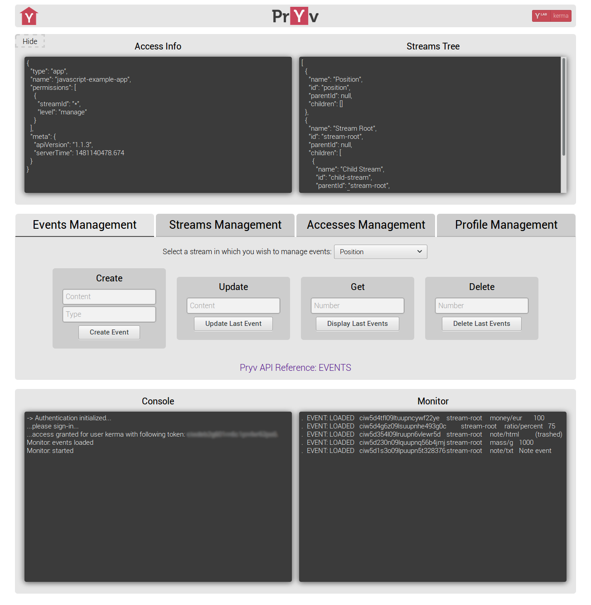

# Pryv Example App

## Description

This application contains examples of the most basic features contained in the [Pryv Javascript Library](https://github.com/pryv/lib-javascript) (authentication, events and streams management).

All the functions using those features are located in `src/js/pryv`.

It is advised to look at the [Javascript Getting Started](http://api.pryv.com/getting-started/javascript/).

## Installation

#### Direct Access

The app is accessible via [Github Pages](https://kerma2.github.io/pryv-example-app/) (it doesn't require any install).

#### Clone/Download

* Prerequisite: __*npm*__ & __*node*__

* At the root of the repository:
  * Install dependencies: `npm install`.
  * Build the app: `npm run grunt`.
  * Start the app: `npm start`.

* Open the link displayed your terminal (default: http://127.0.0.1:8080).

## Config

#### Url Parameters

You can configure the app using url parameters:
  * Token : url/?token={valid-token}
  * Username: url/?username={username}
  * Domain :
    * url/?pryv-domain={custom pryv domain} (example: pryv.io).
    * url/?pryv-domain={custom register domain} (example: reg.pryv.io).

The token and username parameters must be used together.

The access token can be generated using [Pryv Access Token Generation](https://pryv.github.io/app-web-access/?pryv-reg=reg.pryv.me).

These parameters will override the matching parameters set in the `config.json`.

Example: http://127.0.0.1:8080/?username=user&token=ckdlsl4&pryv-domain=pryv.me

#### Config File

The `config.json` is located at the root of the repository:
```
{
  "http": {
    "port": "8080",        // The port listened by the app.
    "ip": "127.0.0.1"      // The ip used by the app.  
  },
  "pryv": {
    "domain" : "pryv.me",  // The Pryv domain.
    "permissions": [{
      "streamId": "*",     // The id of the requested stream (* means all streams).
      "level": "manage"    // The required permission level (read | contribute | manage).
    }]
  }
}
```

## Example


